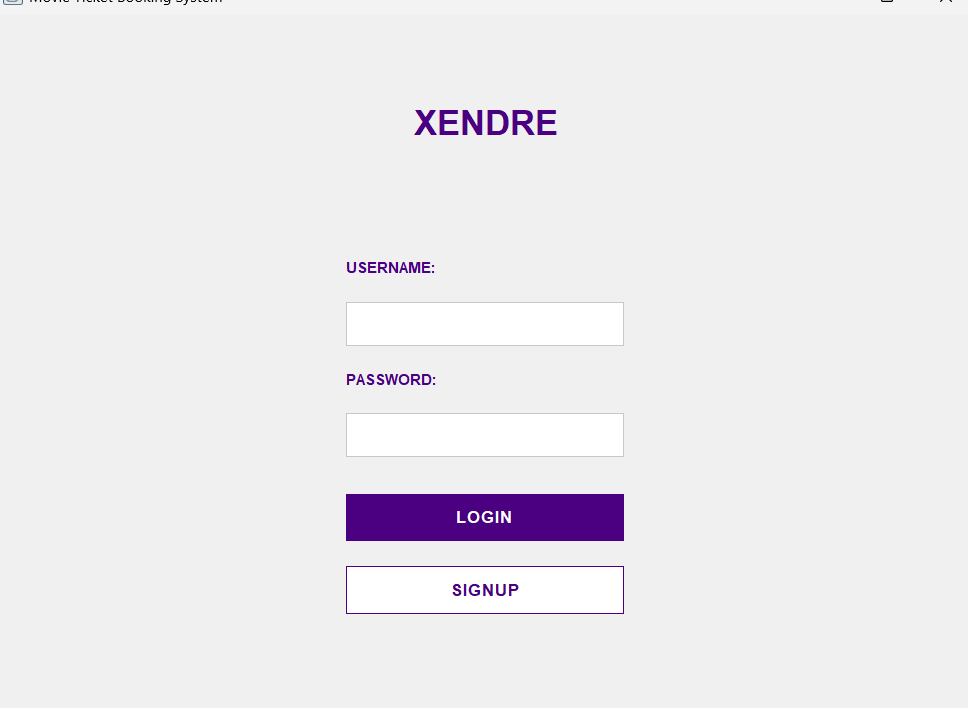
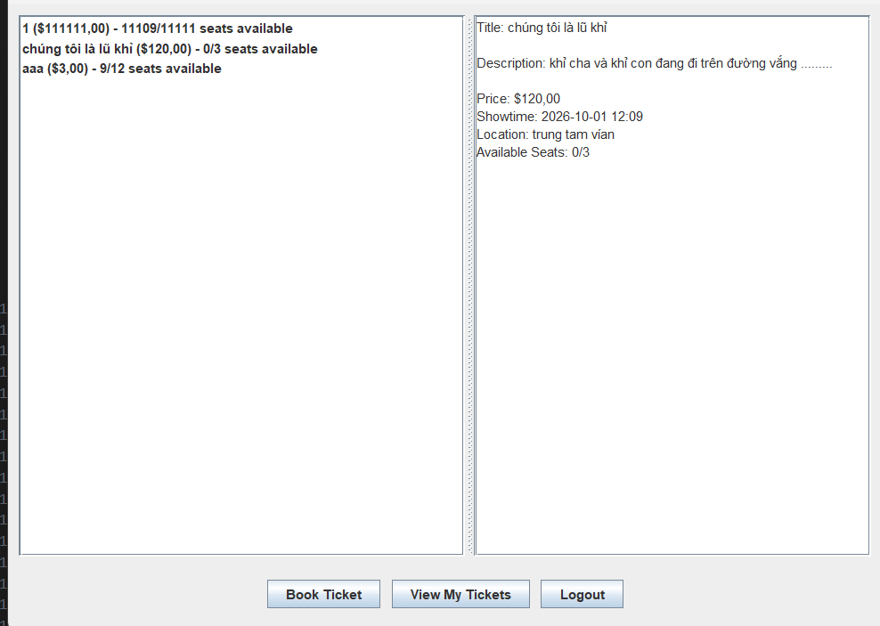
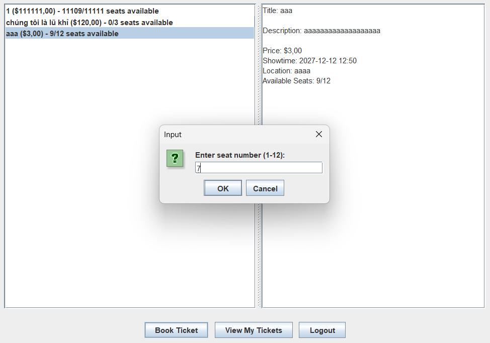
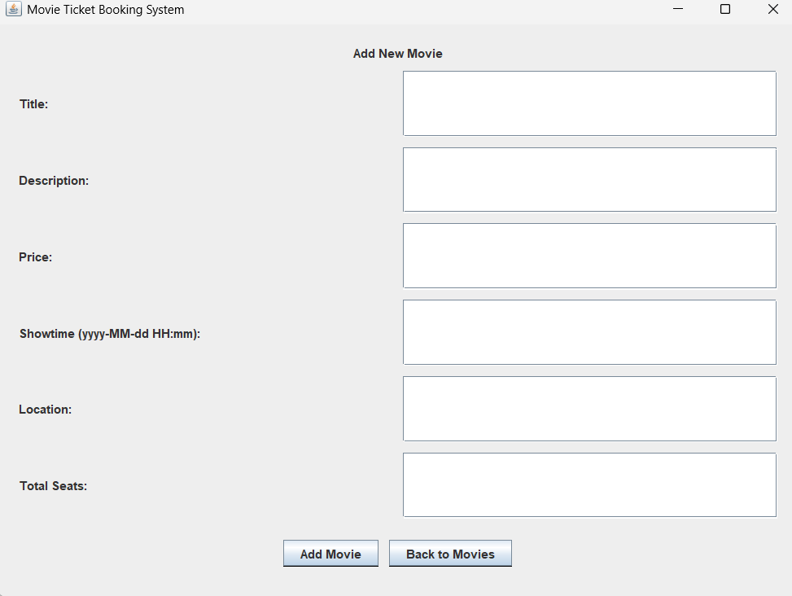

<h2 align="center">
    <a href="https://dainam.edu.vn/vi/khoa-cong-nghe-thong-tin">
    🎓 Faculty of Information Technology (DaiNam University)
    </a>
</h2>
<h2 align="center">
   XÂY DỰNG ỨNG DỤNG ĐẶT VÉ XEM PHIM BẰNG GIAO THỨC TCP
</h2>

    

        
        
        
    

## 1. Giới thiệu hệ thống
   Movie Ticket Booking System là hệ thống đặt vé xem phim trực tuyến được phát triển bằng Java, sử dụng mô hình client-server. Hệ thống cho phép người dùng xem danh sách phim, đặt vé, quản lý vé đã đặt, đồng thời cung cấp chức năng quản lý cho admin để thêm phim mới vào hệ thống.

   Tính năng chính:

   - Đăng ký/Đăng nhập tài khoản

   - Xem danh sách phim với thông tin chi tiết

   - Đặt vé và chọn chỗ ngồi

   - Xem lịch sử vé đã đặt

   - Quản lý phim (cho admin)

   - Lưu trữ dữ liệu trong file text

   - Hỗ trợ đa người dùng

## 2. Công nghệ sử dụng
   🛠️ Ngôn ngữ và Framework

   Java SE (Java Standard Edition)

   Java Swing (GUI)

   Java Socket Programming (Network communication)

   📊 Kiến trúc hệ thống

   Mô hình Client-Server

   TCP/IP Protocol (Port 12345)

   Object Serialization cho truyền dữ liệu

   Multi-threading cho xử lý đa nhiệm

   💾 Lưu trữ dữ liệu

   File-based storage (Text files)

   CSV format cho dữ liệu

   Thư mục data/ chứa:

   users.txt - Tài khoản người dùng

   movies.txt - Thông tin phim

   tickets.txt - Lịch sử đặt vé

## 3. Hình ảnh các chức năng
   
   
   🖼️ Giao diện đăng nhập

   

   
   

   
  🎪 Trang chủ - Danh sách phim

   

   
   

   🎫 Đặt vé
   

   

   
   

   👤 Quản lý vé đã đặt
   

   

   
   

   
   
   🎬 Thêm phim mới (Admin)

   

   
   

## 4. Các bước cài đặt

   📋 Yêu cầu hệ thống

   Java JDK 8 hoặc cao hơn

   Windows/Linux/macOS

   🔧 Cài đặt và chạy ứng dụng

   Bước 1: Tải source code

   git clone [repository-url]

   cd movie-booking-system

   Bước 2: Tạo thư mục và file dữ liệu

   Tạo thư mục data và các file txt với nội dung mẫu:

   data/users.txt:

   admin,admin123,true

   user1,password123,false

   user2,password123,false

   data/movies.txt:

   1,Avengers: Endgame,The epic conclusion,12.5,1672531200000,CGV Vincom,100,100

   2,Spider-Man: No Way Home,Spider-Man seeks help,11.0,1672617600000,Lotte Cinema,80,80

   Bước 3: Biên dịch và chạy tự động

   # Chạy file batch (Windows)

   compile_and_run.bat

   # Hoặc chạy thủ công

   javac -d bin src/*/*.java src/*/*/*.java

   java -cp bin server.MovieServer

   # Mở terminal mới

   java -cp bin client.ClientGUI

   Bước 4: Đăng nhập

   Tài khoản admin: admin / admin123

   Hoặc đăng ký tài khoản mới

## 5. Thông tin liên hệ
   
   
   👨‍💻 Tác giả

   NGUYEN DUC NGOC

   🎓 Student of [DNU University]

   📧 Email: ducngocnguyen004.email@example.com

   🔗 GitHub: ducngocnguyen004

   📞 Hỗ trợ kỹ thuật

   Nếu bạn gặp bất kỳ vấn đề nào với hệ thống, vui lòng:

   Kiểm tra lại các bước cài đặt

   Đảm bảo port 12345 không bị block

   Liên hệ qua email hoặc tạo issue trên GitHub
